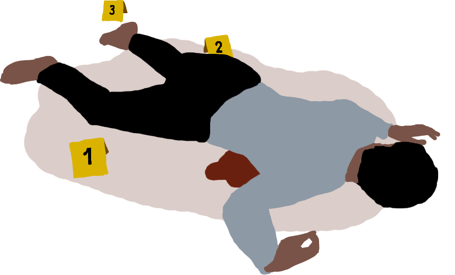

<div align="center" id="top">
  
</div>

<h1 align="center">犯罪现场-CSI（Crime Scene Investigation）</h1>

<p align="center">
  
</p>

<h3 align="center"><a href="http://helloo.world:3004/">线上地址</a></h3>

<p align="center">
  <a href="#dart-简介">简介</a> &#xa0; | &#xa0;
  <a href="#sparkles-features">特色</a> &#xa0; | &#xa0;
  <a href="#rocket-技术栈">技术栈</a> &#xa0; | &#xa0;
  <a href="#deciduous_tree-目录结构">目录结构</a> &#xa0; | &#xa0;
  <a href="#white_check_mark-使用指南">使用指南</a> &#xa0; | &#xa0;
  <a href="https://github.com/uwpdver" target="_blank">作者</a>
</p>

<br>

## 简介

由个人制作的非官方网页版《犯罪现场》桌游。

### 特色

* 界面美观，界面还原桌游。  
* 无需卡牌，当面对面游玩时无需携带卡牌，随时随地开始。  
* 新手友好，如果之前从未接触过《犯罪现场》桌游也无需担心，你开始的每一步都有丰富的引导。  
* 简单干净，没有添加游戏机制以外的功能。  
* 隐私安全，不获取除邮箱账号以外的任何个人信息。  
* 立即恢复，即使中途离开或关闭页面, 刷新页面即可返回游戏。  

### 不足

* 不支持在线语音交流，需要通过其他方式进行语音交流，或者面对面交流。   
* 界面仅为移动端浏览器设计，尚未适配PC浏览器等大屏幕设备。  
* 缺少帮凶角色。
* 不支持效果牌。

## 技术栈

本项目主要运用以下技术:

- [Next.js](https://nextjs.org/)
- [TypeScript](https://www.typescriptlang.org/)
- [Tailwind CSS](https://tailwindcss.com/)
- [Socket.IO](https://socket.io/)
- [Prisma](https://www.prisma.io/)

## 目录结构

```txt
├── docs                          # 相关的文档
├── start.sh                      # 项目部署脚本
├── component                     # 组件
├── constants                     # 常量
├── lib                           # 第三方库有关的逻辑封装或实例化
│   ├── socket                    # 使用Socket.IO有关的代码
│   ├── axios.ts                  # HTTP请求库实例化
│   └── prisma                    # 初始化prisma客户端实例
├── pages                         # 页面
│   ├── api                       # api路由，一些api端点
│   │   ├── matches               # 游戏相关的api模块
│   │   │   ├── [id].ts           # /api/matches/[id]路由的处理函数
│   │   │   ├── exceptions.ts     # 自定义的错误类
│   │   │   ├── index.ts          # /api/matches路由的处理函数
│   │   │   ├── services.ts       # 操作数据库的逻辑
│   │   │   └── utils.ts          # 工具函数
│   │   ├── socket                # socket连接相关的api模块
│   │   │   ├── controller.ts     # 服务端Socket.IO事件的处理函数集合
│   │   │   └── index.ts          # /api/socket路由的处理函数，负责创建和客户端之间的Socket.IO连接
│   │   ├── room                  # 房间相关的api模块
│   │   └── user                  # 用户登录相关的api模块
│   ├── room                      # 等待玩家开始游戏的页面
│   ├── matches                   # 进行游戏的页面
│   ├── login                     # 登录注册的页面
│   ├── room                      # 等待玩家开始游戏的页面
│   ├── matches                   # 进行游戏的页面
│   └── index.ts                  # 首页
├── prisma                        # prisma目录
│   └── schema.prisma             # 数据库模型的定义
├── public                        # 前端公共资源
├── reducer                       # redux形式的状态管理逻辑
├── styles                        # 样式文件
├── types                         # 类型定义
└── utils                         # 工具函数
```

## 使用指南

### 开发

开发项目前, 需要拥有 git 和 node 环境

```bash
# 克隆项目
git clone https://github.com/uwpdver/csi

# 切换当前目录到项目目录，即打开刚克隆下来的文件夹
$ cd csi

# 安装依赖
$ npm i # 如果使用 yarn 的话则改成：yarn install

# 以开发模式运行
$ npm run dev # 如果使用 yarn 的话则改成：yarn dev

# 打开浏览器，在地址栏输入 http://localhost:3000 后按下键盘回车键，即可访问到开发中的应用。
```

### 构建
```bash
# 安装好依赖之后
npm run build # 如果使用 yarn 的话则改成：yarn build

# 安装好依赖之后
npm run start # 如果使用 yarn 的话则改成：yarn start

# 打开浏览器，在地址栏输入 http://localhost:3004 后按下键盘回车键，即可访问到构建好的应用。
```

### 部署
需要安装：nodejs，git，yarn，pm2（如果使用npm需要修改脚本）
```bash
# 克隆项目
git clone https://github.com/uwpdver/csi

# 切换当前目录到项目目录
cd csi

# 执行启动脚本
./start.sh
```

### 如何使用

直接访问[网址](http://helloo.world:3004/)即可!

## 致谢
README文档参考了另一个项目[狼人杀](https://github.com/xiong35/werewolf)的README文档，感谢[xiong35](https://github.com/xiong35)！

<a href="#top">返回顶部</a>